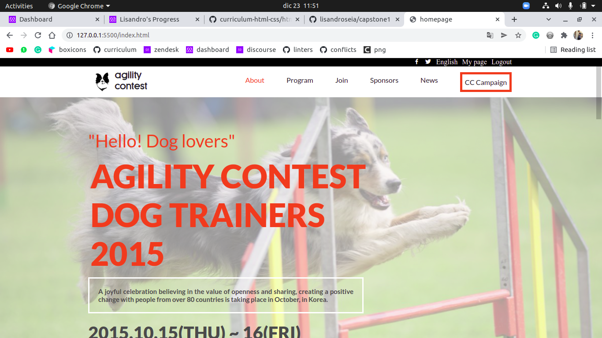

# Capstone

> In this project i made a capstone wit [this requirements](https://github.com/microverseinc/curriculum-html-css/blob/main/capstone/html_capstone.md)

This capstone is a presentagion web page for a dog agility contest, with a completely functional
navigation bar, a mobile menu, and a section created with pure javascript (featured trainers section)

## Built With

- HTML, CSS & JS
- Github

## Live Demo

[Live Demo Link](https://lisandroseia.github.io/capstone1/)

## Getting Started

**This is an example of how you may give instructions on setting up your project locally.**
**Modify this file to match your project, remove sections that don't apply. For example: delete the testing section if the currect project doesn't require testing.**

To get a local copy up and running follow these simple example steps.

### Prerequisites

To check this project you only need internet conection

### Usage

To get the best of this project, you can check it on different sizes, and test the navigation bar

## Authors

👤 **lisandro seia**

- GitHub: [@lisandro seia](https://github.com/lisandroseia)
- LinkedIn: [@lisandro seia](https://www.linkedin.com/in/lisandro-seia-295120225/)

## 🤝 Contributing

Contributions, issues, and feature requests are welcome!

Feel free to check the [issues page](https://github.com/lisandroseia/capstone1/issues).

## Show your support

Give a ⭐️ if you like this project!

## Acknowledgments

- I used  this [template](https://www.behance.net/gallery/29845175/CC-Global-Summit-2015),
  and I tried to adapt it to my topic.
-Original design idea by [Cindy Shin](https://www.behance.net/adagio07)
- I am extremely thankful with all my coding partners, who helped me a lot
- I inspired in my dog, thats why i choosed this topic

## 📝 License

This project is [MIT](https://github.com/lisandroseia/capstone1/blob/main/MIT.md) licensed.
